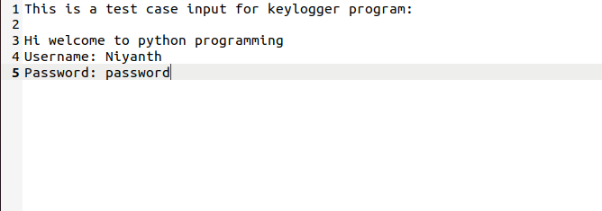
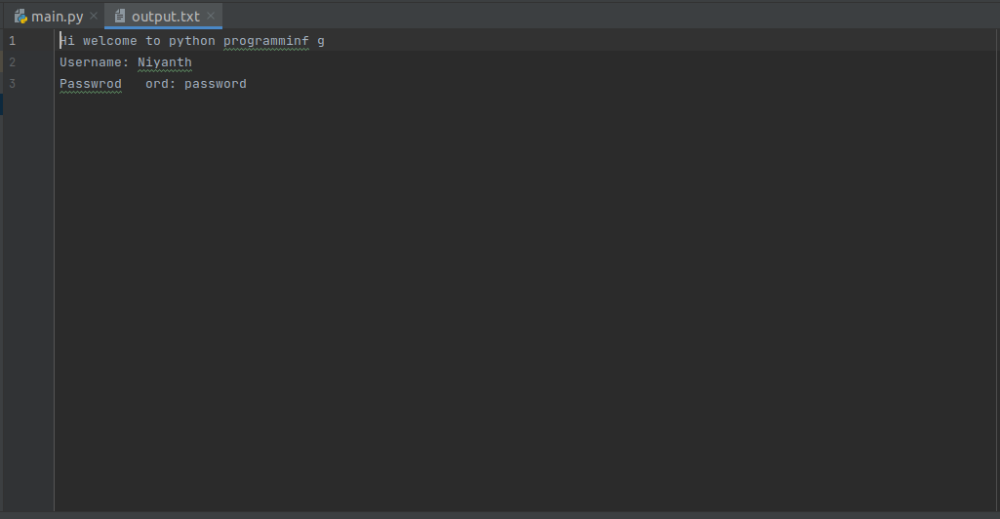

# Keylogger-using-Python
This is a simple keylogger project developed in python. This was developed as a tutorial project.

# What is a Keylogger?
Keystroke logging, often referred to as keylogging or keyboard capturing, is the action of recording (logging) the keys struck on a keyboard,typically covertly, so that a person using the keyboard is unaware that their actions are being monitored.

# Packages required:
The packages that was used to develop this project was pynput

## Output screenshots

